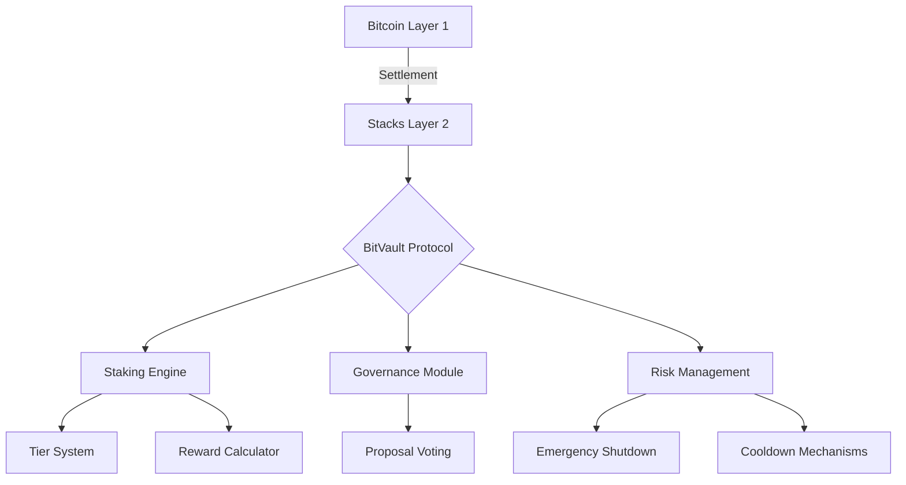

# BitVault Stacking Protocol

Advanced Bitcoin-native staking infrastructure built on Stacks Layer 2, combining sophisticated DeFi mechanics with Bitcoin security.

## Table of Contents

- [BitVault Stacking Protocol](#bitvault-stacking-protocol)
  - [Table of Contents](#table-of-contents)
  - [Overview](#overview)
  - [Key Features](#key-features)
    - [🏦 Tiered Staking System](#-tiered-staking-system)
    - [⚙️ Core Mechanics](#️-core-mechanics)
  - [Architecture](#architecture)
    - [Core Components](#core-components)
  - [Smart Contracts](#smart-contracts)
    - [Key Functions](#key-functions)
    - [Administration](#administration)
  - [Installation \& Deployment](#installation--deployment)
    - [Requirements](#requirements)
    - [Deployment Steps](#deployment-steps)
  - [Usage Guide](#usage-guide)
    - [Basic Staking Flow](#basic-staking-flow)
    - [Advanced Features](#advanced-features)
  - [Governance System](#governance-system)
    - [Proposal Lifecycle](#proposal-lifecycle)
    - [Voting Power](#voting-power)
  - [Security Model](#security-model)
    - [Protection Mechanisms](#protection-mechanisms)
  - [Testing \& Audits](#testing--audits)
    - [Simulation Tools](#simulation-tools)
  - [Get Involved](#get-involved)

## Overview

BitVault is a next-generation stacking protocol enabling STX holders to participate in secure Bitcoin-based DeFi through:

- Tiered reward structures with compounding yields
- On-chain governance powered by staked assets
- Time-locked positions with bonus multipliers
- Non-custodial Bitcoin-native design

## Key Features

### 🏦 Tiered Staking System

| Tier | Minimum STX | Multiplier | Features Enabled |
|------|-------------|------------|------------------|
| Bronze | 1,000 STX | 1x | Basic staking |
| Silver | 5,000 STX | 1.5x | Governance voting, Early unlocks |
| Gold | 10,000 STX | 2x | Multi-position staking, Auto-compounding |

### ⚙️ Core Mechanics

- **Dynamic Rewards Formula**  
  `Rewards = (Staked Amount × Base Rate × Tier Multiplier × Lock Multiplier) / 14400000 per block`
  
- **Lock Period Multipliers**
  - No lock: 1x
  - 30 days (4320 blocks): 1.25x
  - 60 days (8640 blocks): 1.5x

- **Automated Position Management**
  - Real-time health factor monitoring
  - Collateralization ratio checks
  - Automatic reward compounding

## Architecture



### Core Components

1. **Staking Vault**
   - STX token deposits
   - Position tracking with lock periods
   - Reward accumulation system

2. **Governance DAO**
   - Proposal creation and voting
   - Voting power based on staked amounts
   - Time-locked execution

3. **Data Maps**
   - `UserPositions`: Tracks staking positions and rewards
   - `TierLevels`: Defines reward multipliers and features
   - `Proposals`: Stores governance proposals and voting data

## Smart Contracts

### Key Functions

```clarity
;; Stake STX with optional lock period
(stake-stx u1000000 u4320)  ;; 1M STX with 30-day lock

;; Initiate withdrawal
(initiate-unstake u500000)

;; Create governance proposal
(create-proposal "Protocol Fee Adjustment" u1000)

;; Vote on active proposal
(vote-on-proposal u42 true)
```

### Administration

```clarity
;; Emergency pause/resume
(pause-contract)
(resume-contract)
```

## Installation & Deployment

### Requirements

- Clarinet v1.5.0+
- Node.js 18.x
- Stacks.js SDK

### Deployment Steps

1. Clone repository:

   ```bash
   git clone https://github.com/bitvault-protocol/core-contracts.git
   ```

2. Install dependencies:

   ```bash
   npm install @stacks/transactions @stacks/network
   ```

3. Run tests:

   ```bash
   clarinet test
   ```

4. Deploy to mainnet:

   ```bash
   clarinet deployments apply -n mainnet
   ```

## Usage Guide

### Basic Staking Flow

1. Approve STX transfer through your wallet
2. Call `stake-stx` with amount and lock period
3. Monitor position through on-chain queries:

   ```clarity
   (get-user-position tx-sender)
   ```

4. Claim rewards via automated accrual
5. Initiate withdrawal with `initiate-unstake`
6. Complete withdrawal after 24-hour cooldown

### Advanced Features

- **Multi-position Staking** (Gold tier)
- **Governance Delegation** of voting power
- **Emergency Mode** activation by protocol admins

## Governance System

### Proposal Lifecycle

1. **Creation:** Requires 1M+ voting power
2. **Voting:** 100-2880 blocks duration
3. **Execution:** Simple majority wins
4. **Time Lock:** 24-hour delay for critical actions

### Voting Power

```
Voting Power = (Staked STX × Tier Multiplier) / 100
```

## Security Model

### Protection Mechanisms

- 24-hour withdrawal cooldown
- Tier-based rate limiting
- Multi-sig emergency shutdown
- Automated health factor monitoring
- Circuit breaker patterns

## Testing & Audits

### Simulation Tools

Use [Clarity REPL](https://docs.stacks.co/write-smart-contracts/clarity-tools) for local testing:

```bash
clarinet console
>> (contract-call? .bitvault-contract stake-stx u500000 u0)
```

## Get Involved

We welcome contributors to help build Bitcoin-secured DeFi:

- Submit PRs for protocol improvements
- Participate in governance discussions
- Join our bug bounty program

Connect with us on Stacks community channels or through GitHub issues.
